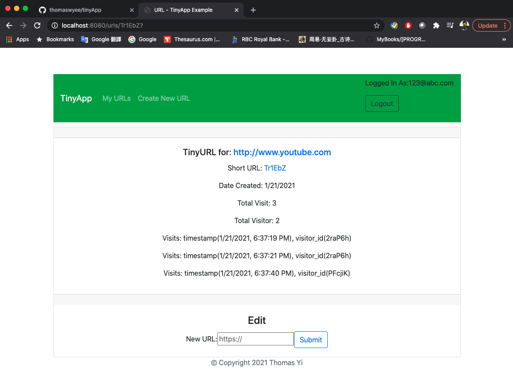

# TinyApp Project

TinyApp is a full stack web application built with Node and Express that allows users to shorten long URLs (à la bit.ly).

## Final Product

1. Register with email and password
   

2. Login with valid email and password (please note that you can only see the shorttened url with the account created)
   

3. My URL page displays all the URLs that you shorttened, with edit and delete features. But you will only see the shorttened URLs that are created by you account. Even though you can access short URL created by other uses.
   

4. When you click the edit button on My URL page, it will redirect you to the edit page, where you can modify your longURL, and see the usage of the short URL.
   

5. You can also create new URL by click the 'Create New URL' from the navigation bar.
   

6. Analytics features. Keep track of the usage of short URL. It won't show the trackings if no one has used the short URL.
   

## Dependencies

- Node.js
- Express
- EJS
- bcrypt
- body-parser
- cookie-session

## Getting Started

- Install all dependencies (using the `npm install` command).
- Run the development web server using the `npm start` command.
- Register with email and password
- Login with vaild email and password
- You can only access the url that you created
- You can edit and delete your url from my urls page
- You can track the usage of the short URL in your edit page
- When you click logout, the session will be deleted and you will need to login again.
